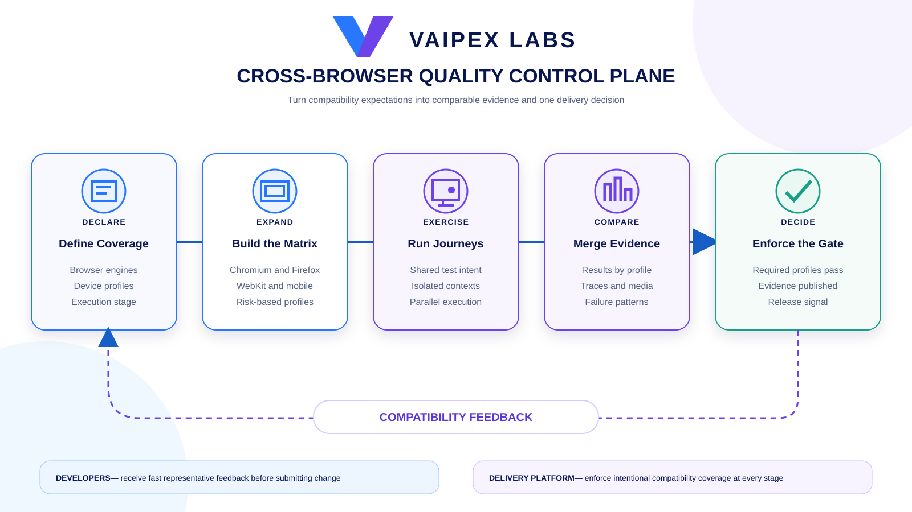
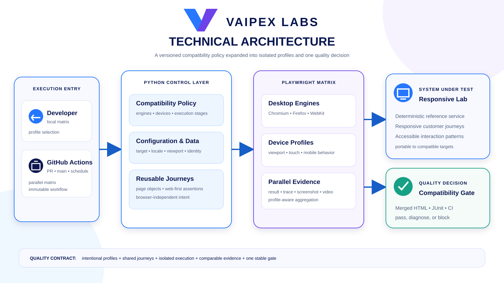

# Vaipex Cross-Browser Quality Control Plane

An open reference implementation for governing browser, device, and viewport
compatibility through a consistent Playwright and Python test matrix. It helps
teams turn compatibility expectations into repeatable quality signals that run
the same way on a workstation and in continuous integration.

Developed by **Vaipex Labs** for the developer and quality engineering
communities.


[Project Intent](#project-intent) ·
[Quality Contract](#quality-contract) ·
[Delivery Flow](#delivery-flow) ·
[Architecture](#architecture) ·
[Set Up the Toolchain](#set-up-the-toolchain) ·
[Explore the Reference Application](#explore-the-reference-application) ·
[Run the Three-Engine Journeys](#run-the-three-engine-journeys) ·
[Run the Compatibility Profiles](#run-the-compatibility-profiles) ·
[Risk-Based Suites and Sharding](#risk-based-suites-and-sharding) ·
[Target Experience](#target-experience) ·
[Delivery Roadmap](#delivery-roadmap) ·
[Repository Structure](#repository-structure)

## Project Intent

A journey that passes in one browser does not prove that customers receive a
consistent experience. Browser engines, viewports, input models, locale, and
network conditions can expose different failures. Running every combination
indiscriminately, however, makes feedback slow and expensive.

This project demonstrates a governed compatibility capability that:

- Declares supported browser and device profiles as versioned configuration.
- Runs the right coverage at pull-request, main-branch, and scheduled stages.
- Reuses business journeys without duplicating browser-specific test code.
- Separates genuine product defects from infrastructure and test instability.
- Preserves browser-specific traces, screenshots, videos, and reports.
- Produces one clear compatibility decision for delivery automation.
- Makes coverage, duration, and failure patterns visible to platform teams.

## Quality Contract

The control plane will enforce five principles:

1. **Explicit support:** every browser and device profile has an owner and
   purpose.
2. **Risk-based coverage:** fast representative checks run before broader
   compatibility suites.
3. **Journey reuse:** tests describe customer outcomes, not browser branches.
4. **Isolated execution:** matrix cells own their context, data, and evidence.
5. **Stable decision:** delivery systems consume one aggregated quality gate.

## Delivery Flow

A change moves from an explicit compatibility policy to isolated execution,
comparable evidence, and a single governed release decision.



## Architecture

Developers and GitHub Actions invoke the same Python control layer. A matrix
orchestrator expands the declared policy into browser and device profiles,
executes reusable journeys against the reference application, and aggregates
the resulting evidence into one quality decision.



## Target Experience

The finished implementation will provide one short demonstration:

```bash
./scripts/two-minute-demo.sh
```

It will validate the locked toolchain, execute representative Chromium,
Firefox, WebKit, desktop, and mobile profiles, merge their evidence, and print
the final compatibility decision.

## Set Up the Toolchain

Python 3.12 is required. Create or reconcile the local environment with:

```bash
./scripts/setup.sh
./scripts/validate-toolchain.sh
```

The setup command installs the complete dependency graph from
`requirements.lock` and records that lock inside `.venv`. Every supported
entry point automatically reruns setup when the environment is missing or the
lock has changed.

Install all three Playwright engines before the first cross-browser run:

```bash
./scripts/install-browsers.sh
```

Install a smaller selection when only one engine is needed:

```bash
./scripts/install-browsers.sh chromium
./scripts/install-browsers.sh firefox webkit
```

On a Linux host that also needs browser operating-system packages, run with
`PLAYWRIGHT_WITH_DEPS=1` and suitable system privileges.

## Explore the Reference Application

The repository includes **Vaipex Explorer**, a deterministic responsive
planning application designed specifically for compatibility automation. Start
it with:

```bash
./scripts/start-app.sh
```

Open [http://127.0.0.1:8000](http://127.0.0.1:8000) and stop the application
with `Ctrl+C`.

The target provides:

- A desktop navigation bar and accessible mobile navigation menu.
- A responsive experience catalog with deterministic search behavior.
- Locale-aware currency formatting through the browser runtime.
- A client-side itinerary that reflows across desktop and mobile viewports.
- An accessible booking dialog and deterministic confirmation contract.
- Health, catalog, booking, and test-control APIs.
- Stable user-facing labels and explicit test attributes where necessary.

The application deliberately owns its data and behavior. Cross-browser results
therefore reflect engine or profile differences rather than external websites,
rate limits, or shared test state.

## Run the Three-Engine Journeys

Execute the same customer outcomes in Chromium, Firefox, and WebKit:

```bash
./scripts/test-cross-browser.sh
```

The command installs the pinned browser builds and executes two reusable
journeys in every engine:

1. Filter the catalog, add the Kyoto experience, and verify the itinerary.
2. Build a multi-city plan and receive a deterministic booking confirmation.

The six executions share page objects, configuration, and assertions. No test
contains a browser-specific branch. Each engine receives a fresh browser
context, and the local application starts and stops automatically.

Every run produces:

- `reports/cross-browser.html` for human review.
- `reports/cross-browser.xml` for CI and quality-system integration.
- Failure-only screenshots, traces, and videos under `artifacts/playwright/`.

Point the same journeys at a compatible deployed environment:

```bash
VAIPEX_BASE_URL=https://explorer.example.test ./scripts/test-cross-browser.sh
```

Set `VAIPEX_EXPECT_TIMEOUT_MS`, `VAIPEX_TRAVELER_NAME`, and
`VAIPEX_TRAVELER_EMAIL` to adjust the validated runtime configuration without
changing test code.

## Run the Compatibility Profiles

Execute the representative desktop, mobile, locale, and capability profiles:

```bash
./scripts/test-profiles.sh
```

| Profile | Risk represented |
| --- | --- |
| `desktop-standard` | Primary 1440×900 desktop release signal |
| `desktop-compact` | Constrained 1024×768 layout and British English |
| `mobile-touch` | 390×844 viewport, touch input, and 3× pixel density |
| `french-locale` | French formatting and European timezone behavior |
| `reduced-motion` | Operating-system preference for reduced motion |

Each profile first proves that the browser context matches its versioned
contract and then runs a real catalog-to-itinerary outcome. Prices are asserted
using the application text produced by that browser's locale rather than a
hard-coded language-specific value.

The core customer journeys still run across all three engines. The additional
profiles run in Chromium as representative capability checks. This risk-based
shape avoids 15 mostly redundant engine/profile combinations while retaining a
clear signal for each supported dimension.

## Risk-Based Suites and Sharding

Use a fast representative signal while developing or reviewing a change:

```bash
./scripts/test-risk-suite.sh smoke
```

Run both the smoke and broader booking journeys across every engine:

```bash
./scripts/test-risk-suite.sh regression
```

Split the six core browser executions into two deterministic parallel shards
and merge their evidence:

```bash
./scripts/test-sharded.sh
```

The sharding algorithm sorts the fully parameterized Pytest node IDs and
assigns them round-robin. Every execution belongs to exactly one shard, the
distribution stays stable when collection order changes, and an invalid shard
contract is rejected before browser execution.

Each shard publishes its own HTML, JUnit, log, and failure evidence. After all
shards finish, the control plane produces:

- `reports/merged/index.html` — consolidated human-readable decision.
- `reports/merged/junit.xml` — combined machine-readable test suites.
- `reports/merged/summary.json` — compact status and count contract.

Set `VAIPEX_SHARD_TOTAL` to change the local shard count. CI can invoke
`./scripts/run-shard.sh INDEX TOTAL` directly so each runner owns one shard.

## Continuous Quality Gate

The GitHub Actions workflow uses the same repository scripts that developers
run locally. Pull requests, changes to `main`, weekday schedules, and manual
runs trigger four governed stages:

1. Validate the pinned Python toolchain, formatting rules, and unit contract.
2. Run two deterministic browser shards concurrently with fail-fast disabled.
3. Exercise desktop, mobile, locale, and reduced-motion profiles in Chromium.
4. Merge the shard reports into one HTML, JUnit, and JSON quality decision.

Every external action is pinned to an immutable commit. The workflow has
read-only repository access, prevents duplicate pull-request runs, retains
failure evidence for seven days, and retains the merged decision for fourteen
days. The required branch-protection check should be **Merged quality
decision**, because it represents the consolidated release signal.

## Compatibility Dimensions

| Dimension | Planned profiles |
| --- | --- |
| Browser engine | Chromium, Firefox, WebKit |
| Desktop viewport | Standard laptop and wide desktop |
| Mobile device | Touch-oriented phone profiles |
| Environment | Local reference application or compatible deployed target |
| Execution stage | Pull request, main branch, and scheduled regression |
| Evidence | HTML, JUnit, trace, screenshot, and video |

The matrix will remain intentionally small. Each profile must detect a distinct
risk or provide a deliberate release signal.

## Delivery Roadmap

- [x] Establish the repository, quality contract, licensing, and project shape.
- [x] Add the locked Python and Playwright toolchain.
- [x] Deliver a deterministic responsive reference application.
- [x] Implement reusable journeys across Chromium, Firefox, and WebKit.
- [x] Add desktop, mobile, locale, and capability profiles.
- [x] Introduce risk-based suites, sharding, and merged evidence.
- [x] Enforce the cross-browser matrix through GitHub Actions.
- [ ] Publish the two-minute demo and operating guidance.

Each milestone is independently reviewable and preserves a usable project
state.

## Toolchain

| Tool | Role |
| --- | --- |
| Python | Automation and orchestration language |
| Playwright for Python | Chromium, Firefox, WebKit, and device emulation |
| Pytest | Fixtures, markers, parametrization, and assertions |
| pytest-xdist | Parallel matrix execution |
| FastAPI | Deterministic responsive reference application |
| Ruff | Python formatting and linting |
| GitHub Actions | Continuous compatibility-gate enforcement |

Direct dependencies are declared in `pyproject.toml`; the complete transitive
environment is pinned in `requirements.lock`.

## Repository Structure

```text
.github/             Continuous quality and dependency automation
docs/images/         Vaipex delivery-flow and architecture illustrations
src/                 Python control plane and reference application
tests/               Fast contracts and reusable browser journeys
scripts/             Supported setup, execution, and demonstration commands
pyproject.toml       Package metadata and tool configuration
requirements.lock   Fully resolved runtime and test dependency versions
```

## Contributing

Community contributions are welcome. Keep compatibility profiles intentional,
journeys browser-agnostic, execution isolated, and evidence actionable.

Licensed under the [Apache License 2.0](LICENSE).
